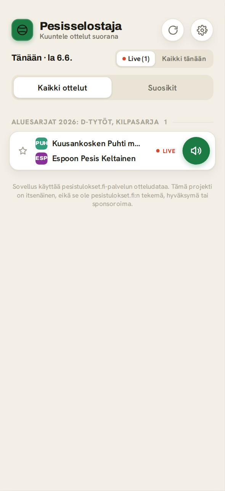

# Pesisselostaja

Web app for following Finnish pesapallo live events with spoken voice announcements.

[Try the web app](https://midnight-builds.github.io/pesisselostaja/)

## Lyhyesti suomeksi

Pesisselostaja on selaimessa toimiva pesäpallon live-seuranta, joka lukee ottelun tärkeimmät tapahtumat ääneen suomeksi. Se on tarkoitettu tilanteisiin, joissa haluat seurata peliä ilman että katsot koko ajan tulospalvelua.
Jaksojen ja palojen seuranta on vielä vajaa ja kertoo välillä vääriä arvoja.

**👉 Avaa sovellus: https://midnight-builds.github.io/pesisselostaja/**

Käyttö:

1. Avaa web-sovellus.
2. Valitse käynnissä oleva ottelu tai syötä ottelun tunnus.
3. Käynnistä seuranta ja salli selaimen puhetoiminto, jos selain pyytää lupaa.
4. Sovellus ilmoittaa ääneen esimerkiksi juoksut, palot, vuoronvaihdot ja jakson tilanteen.

**Jaa ottelu:** Jokaisella ottelulla on oma osoite (`#ottelu/<id>`), joka näkyy selaimen osoiterivillä ottelua seuratessa. Ottelunäkymän **Jaa**-napista voit lähettää linkin eteenpäin (tai kopioida sen leikepöydälle) — linkistä ottelu avautuu suoraan. Ottelunäkymästä pääsee myös katsomaan ottelun tarkemmat tilastot pesistulokset.fi-palvelussa (aukeaa uuteen välilehteen).

**Vinkki – parempi ääni:** Asetuksista voit valita käytettävän puheäänen. Oletuksena käytetään selaimen omaa puhesyntetisaattoria, mutta ottamalla käyttöön **Edistynyt ääni (Piper)** saat luonnollisemman suomenkielisen neuroverkkoäänen, joka toimii kokonaan selaimessa. Valittavana on Harri-ääni (CC0, lähde rhasspy/Piper) sekä yhteisömalli Asmo (CC BY-NC 4.0, tekijä AsmoKoskinen, epäkaupalliseen käyttöön). Ääni ladataan kerran ja tallennetaan selaimeen, joten se on heti käytössä seuraavilla kerroilla. Jos lataus ei onnistu, sovellus palaa selaimen omaan ääneen. Piper- ja ElevenLabs-äänille voi lisäksi kytkeä päälle **Kaiutintilan**, joka vahvistaa selostuksen normaalia kovemmalle esimerkiksi ulkokäyttöön kännykän kaiuttimesta. Kolmas vaihtoehto on **ElevenLabs (oma avain)**: laadukkain ääni, joka syntetisoidaan ElevenLabsin pilvipalvelussa omalla API-avaimellasi. Avain tallentuu vain omaan selaimeesi ja synteesi kuluttaa omia ElevenLabs-krediittejäsi; virhetilanteessa (esim. krediitit loppu) sovellus palaa selaimen ääneen. Äänten lähteet ja lisenssit: [CREDITS.md](CREDITS.md).

Sovellus käyttää pesistulokset.fi-palvelun otteludataa. Tämä projekti on itsenäinen, eikä se ole pesistulokset.fi:n tekemä, hyväksymä tai sponsoroima.

## Overview

Pesisselostaja turns live Finnish pesäpallo match updates into spoken Finnish announcements. The public web UI runs in the browser and can speak important match events with the Web Speech API. You can pick which voice to use in the settings, including an optional **advanced neural voice (Piper)** that produces a more natural Finnish voice entirely in the browser.

The repository also contains a broadcast pipeline (`apps/broadcast`) that can
republish a live YouTube stream with the same Finnish narration mixed on top.

## Screenshots

  
  
  

*Left to right: live match list, favorites tab, voice-active match view.*

## Status

Alpha / public preview.

What works now:

- Browser-based live match following from pesistulokset.fi data.
- Spoken Finnish announcements for important live events.
- Selectable speech voice: the browser's own voices, an advanced neural voice (Piper) that runs fully in the browser, or ElevenLabs cloud TTS with the user's own API key.
- Favorites and local settings stored in the browser.
- A YouTube broadcast pipeline that mixes synthesized narration over a live stream (`apps/broadcast`).

Known limitations:

- The current web UI is a public preview.
- A redesigned UI is planned.
- The project depends on public pesistulokset.fi endpoints observed from the website frontend.

## Data Source And Affiliation

Pesisselostaja uses live match data from pesistulokset.fi. This project is independent and is not affiliated with, endorsed by, or sponsored by pesistulokset.fi. The data source and API behavior may change without notice.

## Web App Usage

Open the public web app:

~~~text
https://midnight-builds.github.io/pesisselostaja/
~~~

The web app can:

- list live matches for the current day
- open a match by match ID or pesistulokset.fi match URL
- announce key events with browser speech synthesis
- let you choose the speech voice, or enable the advanced neural voice (Piper) from settings for a more natural Finnish voice
- save favorite matches and pronunciation settings in local browser storage

No server account is required. The web app stores settings locally in the browser.

## Repository Layout

An npm-workspaces monorepo: one platform-agnostic domain core, three thin apps.

| Workspace | What it is |
| --- | --- |
| `packages/core` | Pure domain logic: types, pesistulokset API client, speech text generation, scoring, pronunciation substitution. No localStorage, no fs, no DOM. |
| `apps/web` | The mobile browser app (Vite). Browser adapters: localStorage persistence, Web Speech / Piper-WASM voices. Deployed to GitHub Pages. |
| `apps/broadcast` | The YouTube broadcast pipeline: pulls a live stream with yt-dlp, mixes synthesized narration (ElevenLabs API, native-Piper fallback) with ffmpeg, republishes over RTMP. Node adapters: file persistence, ElevenLabs/Piper TTS. See [`apps/broadcast/README.md`](apps/broadcast/README.md). |
| `apps/server` | Minimal static file server hosting the built web app on :3000. |

Persistence goes behind small ports defined in core (`WatcherStateStore`,
`PronunciationStore`); each app supplies its own adapter.

## How It Works

- The apps fetch match metadata and live events from pesistulokset.fi endpoints (API client in `packages/core`).
- Event data is converted into short Finnish announcement text (`packages/core/src/speech.ts`).
- The browser app speaks announcements with the Web Speech API or the in-browser Piper voice; the broadcast app synthesizes them with the ElevenLabs API (falling back to native Piper) and mixes them into a live stream.
- Deduplication state prevents the same event from being announced repeatedly.

## Development

~~~bash
npm ci
npm run lint       # all workspaces
npm test           # root vitest, covers all workspace test dirs
npm run typecheck  # all workspaces
npm run build      # all workspaces
~~~

Single workspace: `npm run typecheck -w @pesisselostaja/web` etc.
Workspace names: `@pesisselostaja/core`, `@pesisselostaja/web`,
`@pesisselostaja/broadcast`, `@pesisselostaja/server`.

### Self-hosting on :3000

`apps/server` is a minimal static file server that hosts the built web app on
port 3000 (systemd unit `pesisselostaja.service` runs
`node apps/server/dist/index.js` from the repo root). Old `/v2/` bookmarks
redirect to `/`. It serves files only — no watcher and no API endpoints; the
browser app talks to pesistulokset.fi directly.

Note: the old v1 server's `POST /api/debug-log` endpoint (mobile `?debug=1`
logging to `debug.log`) was dropped with v1 — `?debug=1` posts now fail
silently, same as on the GitHub Pages deployment.

## Limitations

- Player name resolution depends on the match metadata. If a player ID in an event doesn't match the roster, the name will show as "?".
- The app depends on public pesistulokset.fi endpoints observed from the website frontend. These endpoints may change, rate-limit, or stop working without notice.
- The events API structure is reverse-engineered from the frontend; it may change.
- Score summaries are only available for completed matches (from the result field).
- Jakso- and palo-tracking is based on heuristics derived from the event stream and may still have edge cases — particularly in youth game variants where the rules differ from standard pesäpallo (e.g. more than three palot per turn).
- Player name resolution depends on match metadata. If a player ID in an event does not match the roster, the app falls back to a less specific announcement.
- Browser speech quality depends on the user's device, browser, and installed Finnish voices. For more consistent quality, enable the advanced neural voice (Piper) in settings; the voice model (roughly 20–60 MB) is downloaded once and cached in the browser.

## Roadmap

- Redesigned web UI.
- Stronger demo/test fixtures for public examples.

## Voices, Sources And Licenses

The optional advanced neural voice uses Piper voice models and a speech stack that
have their own licenses. They are downloaded in the browser at runtime and are not
bundled in this repository:

- **Harri** (`fi_FI-harri`) — CC0 1.0, from rhasspy/Piper (Finnish Single Speaker Speech Dataset).
- **Asmo** (`fi_FI-asmo-medium`) — CC BY-NC 4.0 by AsmoKoskinen; a non-commercial community model, used with attribution.
- Speech stack: Piper (MIT), `@diffusionstudio/piper-wasm` (embeds espeak-ng, GPL-3.0-or-later), onnxruntime-web (MIT).

Full attribution, source links and license notes are in [CREDITS.md](CREDITS.md).
The canonical machine-readable list lives in [`apps/web/src/piper.ts`](apps/web/src/piper.ts).

## License

This project's own code is MIT. See [LICENSE](LICENSE). Third-party voices and
libraries keep their own licenses — see [CREDITS.md](CREDITS.md).
